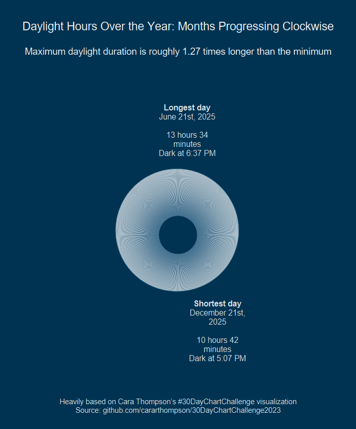
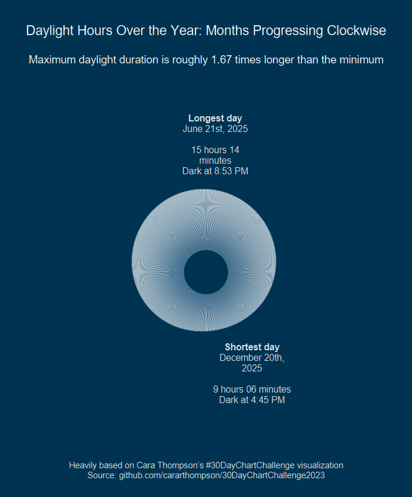
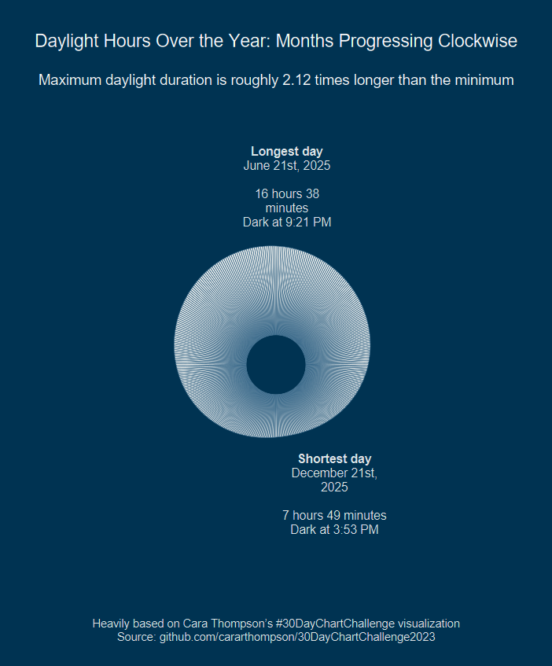

# Daylight Hour Visualization

When I first moved to Ames, Iowa, one of the things that really surprised me was how much the daylight hours change between summer and winter. Back home in Ranchi, Jharkhand (India), the amount of daylight stays pretty consistent year-round, so this was a new experience for me.

Recently, I came across an interesting [visualization](https://github.com/cararthompson/30DayChartChallenge2023?tab=readme-ov-file#day-11---circular----rstats) on LinkedIn by Cara Thompson. It showed daylight hours in Edinburgh in a circular format, and that inspired me to build a small [Shiny App](https://ashirwad-barnwal.shinyapps.io/daylight-hours/) where you can pick any location on Earth and see how daylight hours change throughout the year.

Here are a few examples from places I’ve lived in or visited or are really interesting:

### Ranchi, Jharkhand, India (Hometown)

### Ames, Iowa, USA (Current Location)

### London, UK

### Svalbard, Norway

## Acknowledgements

Big thanks to [Cara Thompson](https://www.linkedin.com/in/cararthompson/) for the inspiration and for sharing her code, which I used heavily to generate the graphics.

## License

Everything in this repo is available under the [MIT License](https://ashirwad-barnwal.mit-license.org/).
